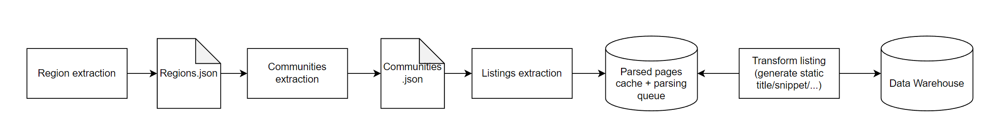

## DAG overview
In short, logically DAG consists of two parts: extracting and transformation. To be more precise there are 4 steps involved:
1. Scrape website and persist partitioned `regions.json`. Parallelized by cities.
2. Read `regions.json` in parallel and scrape respective communities. Results are saved in the partitioned `communities.json`.
3. Using communities scrape listings and save them in an arbitrary database sharded by communities. Implementation can vary heavily depending on scale. One solution can be maintaining [queue of listings to process](https://github.com/donnemartin/system-design-primer/blob/master/solutions/system_design/web_crawler/README.md).
4. As soon as listings get to the cache they can be transformed and inserted into the main DW for a future analysis.

Figure#1: DAG visualised

## Persistence tools
Any cloud provider can be used. For instance, json files can be stored on S3, cache can be Memcached or Dynamodb or even RDS and DW is Redshift.

## Scaling
This solution is ideal for medium-sized throughput (1M new listings every day).

On the one hand, extraction steps can be merged into a single one in case throughput is lover.

On the other hand, extra sharding can be used on steps 3-4. For instance, communities can be partitioned by location. Cache can be sharded by location, property price and type, etc.

